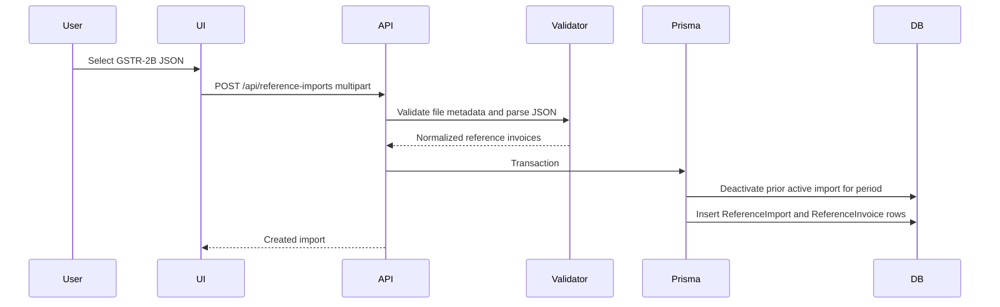
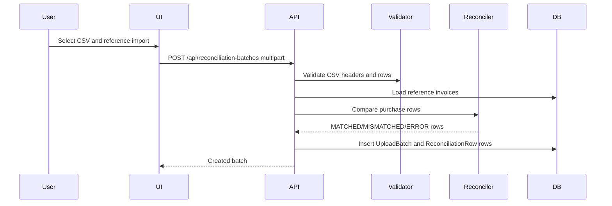

# Data Flow

## Reference Import Flow

Implementation: `src/app/api/reference-imports/route.ts`.

## Purchase Register Upload Flow

## Reconciliation Flow

The current reconciliation flow is synchronous during upload:

1. Reference invoices are loaded for the selected `referenceImportId`.
2. They are indexed by supplier GSTIN and normalized invoice number.
3. Each CSV row is validated independently.
4. Valid rows are compared to the best reference candidate.
5. Invalid rows become `ERROR`; missing or differing reference data becomes `MISMATCHED`; exact compared values become `MATCHED`.

## Batch Detail Retrieval

- Page: `src/app/(app)/reconciliations/[batchId]/page.tsx`.
- API summary: `src/app/api/reconciliation-batches/[batchId]/route.ts`.
- Status API: `src/app/api/reconciliation-batches/[batchId]/status/route.ts`.
- Results API: `src/app/api/reconciliation-batches/[batchId]/results/route.ts`.

## Dashboard / History Retrieval

- Dashboard reads counts and recent imports/batches for the authenticated business.
- History pages fetch the latest 25 records.
- Reference import detail uses `Promise.all` for independent related-data queries.
