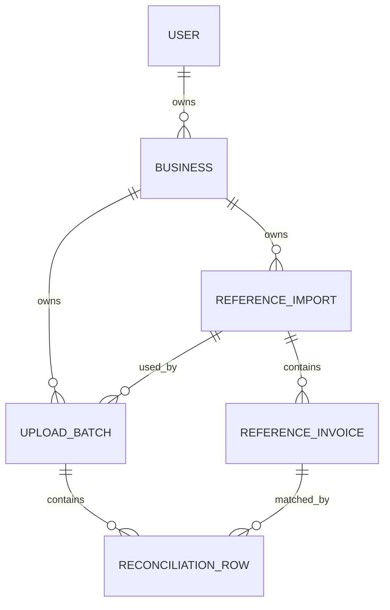

# Database Design

Source of truth: `prisma/schema.prisma`.

## ER Diagram

## Models

| Model | Purpose | Primary Key | Important Relations |
| --- | --- | --- | --- |
| `User` | Account identity | `id` UUID | owns many `Business` records |
| `Business` | GSTIN-scoped workspace | `id` UUID | belongs to `User`, owns imports and batches |
| `ReferenceImport` | One imported GSTR-2B dataset | `id` UUID | belongs to `Business`, has invoices and batches |
| `ReferenceInvoice` | Normalized GSTR-2B invoice | `id` UUID | belongs to `ReferenceImport`, may match rows |
| `UploadBatch` | One Purchase Register upload | `id` UUID | belongs to `Business` and `ReferenceImport` |
| `ReconciliationRow` | Parsed row result | `id` UUID | belongs to `UploadBatch`, optional matched invoice |

## Enums

- `ReferenceImportStatus`: `QUEUED`, `PROCESSING`, `READY`, `FAILED`.
- `UploadBatchStatus`: `QUEUED`, `PROCESSING`, `COMPLETED`, `COMPLETED_WITH_ERRORS`, `FAILED`.
- `RowProcessingStatus`: `PENDING`, `PROCESSING`, `COMPLETED`, `FAILED`.
- `ReconciliationResult`: `PENDING`, `MATCHED`, `MISMATCHED`, `UNMATCHED`, `ERROR`.
- `RowErrorCode`: validation and row processing error codes such as `INVALID_GSTIN`, `NEGATIVE_AMOUNT`, and `DUPLICATE_IN_BATCH`.

## Important Constraints And Indexes

- `User.email` is unique.
- `Business.gstin` is unique.
- `ReferenceInvoice` is unique by `referenceImportId`, `supplierGstin`, `normalizedInvoiceNumber`, and `invoiceDate`.
- `ReconciliationRow` is unique by `batchId` and `rowNumber`.
- Common lookup indexes exist on business, status, reference import, matched reference, processing result, and supplier/invoice normalized keys.

## Monetary Data

Invoice values use PostgreSQL `Decimal(18, 2)` through Prisma. This avoids floating-point rounding issues for taxable value, GST components, cess, and total invoice value.

## Ownership Boundaries

Business ownership is the main authorization boundary. API and page queries filter by `businessId`, and some mutations verify `Business.ownerId` against the authenticated user.

## Cascade Behavior

- Deleting a `ReferenceImport` cascades to `ReferenceInvoice`.
- Deleting an `UploadBatch` cascades to `ReconciliationRow`.
- Deleting a matched reference invoice sets `matchedReferenceId` to null on rows.
- Business/user deletion is restricted where it would orphan core records.

## Migration Strategy

Migrations are committed under `prisma/migrations`. The repo currently has a baseline reconciliation schema migration and a password-hash migration. `docs/database-migrations.md` documents using `prisma migrate dev` locally and `prisma migrate deploy` for deployed environments.
