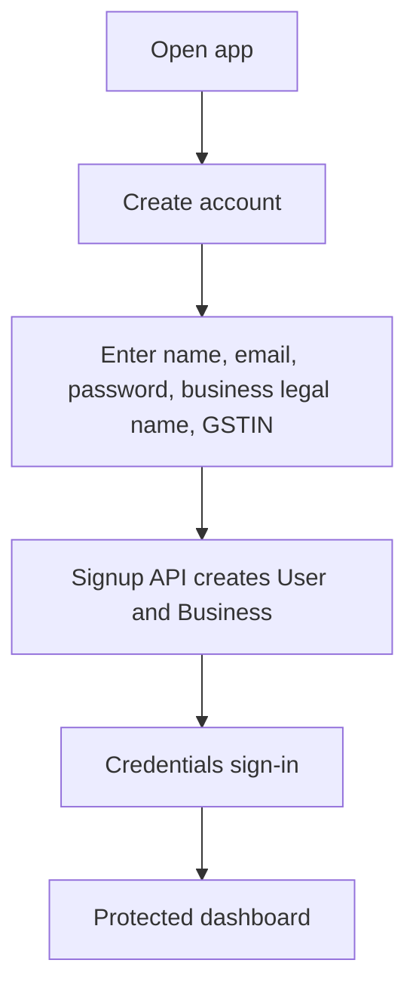
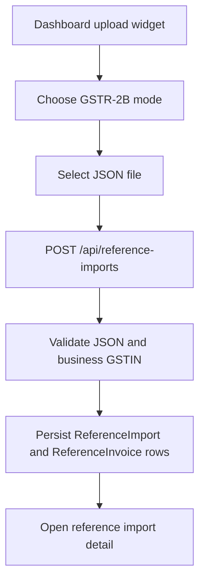
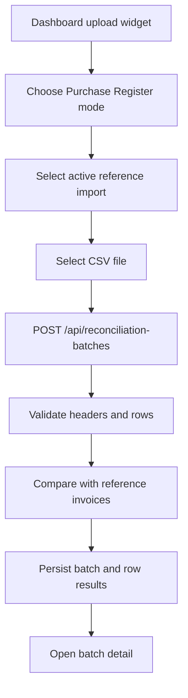
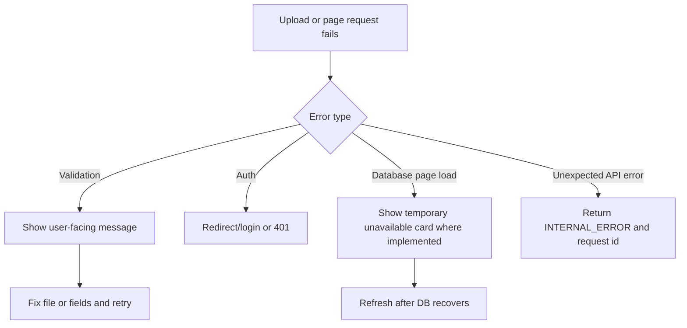

# Product Workflows

## First-Time User Flow

## Reference Data Import Flow

## Purchase Register Upload Flow

## Reconciliation Flow

Valid rows are compared against GSTR-2B reference invoices. Exact compared fields become `MATCHED`; valid rows with missing or differing reference data become `MISMATCHED`; malformed rows become `ERROR`.

## Batch Detail Flow

The user opens `/reconciliations/[batchId]`. The page verifies the batch UUID, requires a session, filters by the user's `businessId`, renders summary counters, shows linked reference import metadata, and lists up to 50 row results.

## History Flow

The user opens `/reconciliations` or `/reference-imports`. Each page loads the latest 25 records for the authenticated business and links to detail pages.

## Error Recovery Flow

