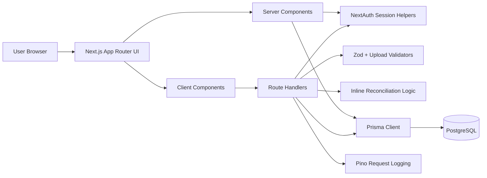

# System Architecture

## Overview

The application is a single Next.js 16 App Router codebase. It combines server-rendered pages, client components for forms/uploads, route handlers for JSON and multipart APIs, NextAuth for authentication, Zod validation, Prisma ORM, and PostgreSQL persistence.

## Presentation Layer

- App routes live under `src/app/(app)` and `src/app/(auth)`.
- Dashboard, history, and detail pages are server components that query Prisma directly after calling `requireCurrentUser()`.
- Client-side interaction is limited to sign-in/signup, upload controls, copy controls, and setup forms.

## Application / Server Layer

- API route handlers live under `src/app/api`.
- Route handlers use standard Next App Router `route.ts` conventions.
- `export const dynamic = "force-dynamic"` is used for private API data that must be fetched at request time.
- `connection()` is used on several private pages to force request-time rendering.

## Authentication Layer

- NextAuth v4 configuration is in `src/lib/auth-options.ts`.
- `src/proxy.ts` redirects unauthenticated page requests to `/login`.
- APIs still call `requireApiUser()` so API authorization is enforced server-side.

## Domain Logic

- Upload parsing and normalization are in `src/lib/upload-validation.ts`.
- Reconciliation logic is currently implemented inside `src/app/api/reconciliation-batches/route.ts`.
- Validation schemas live in `src/lib/validation`.

## Persistence Layer

- Prisma schema: `prisma/schema.prisma`.
- Client creation and PostgreSQL pool config: `src/lib/prisma.ts`.
- Migrations: `prisma/migrations`.

## External Services

Implemented: PostgreSQL database and optional Google OAuth.

Configured/planned but not implemented in code: GCP project, Cloud Storage bucket, and Cloud Tasks queue in `.env.example`.

## Why This Architecture Fits

The project is a small team MVP. A single Next.js codebase keeps UI, route handlers, auth, validation, and database access close together. Prisma and PostgreSQL give a reliable relational model for ownership, imports, batches, and row-level results without needing a separate backend service yet.
